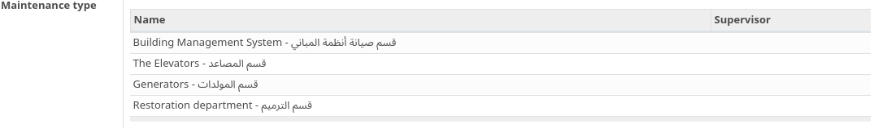
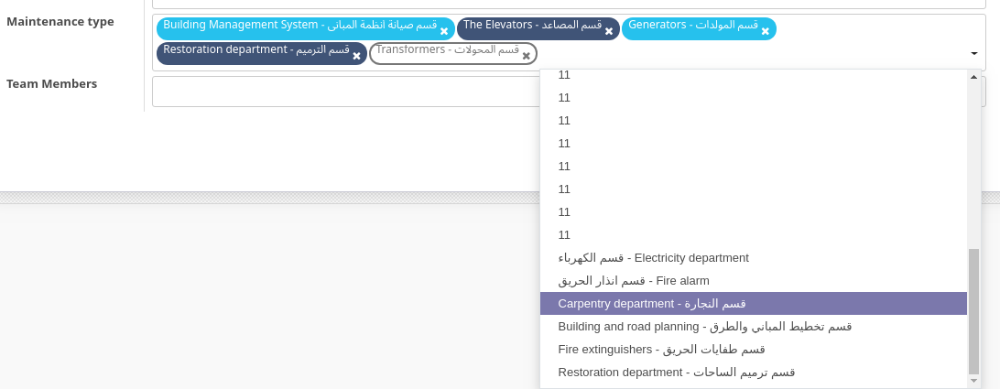
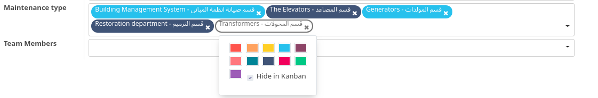
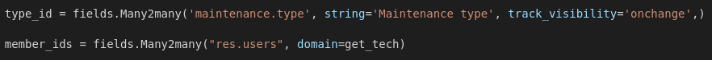
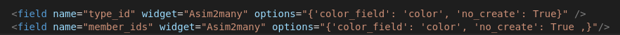

# Many2many_widget By [Asim Altayb](http://facebook.com/mr.asim545)
## Show Your Many2many list with nice style

> here before add our addon sytle is soo bad for clients.



> and here after add our addon


# How To Use :
__first In your *Python* Code declare your Many2many field__

```
type_id = fields.Many2many("res.users")

```

### like below image

__Secind In your *Xml* Code use your Many2many field__

```
<field name="type_id" widget="Asim2many" options="{'color_field': 'color', 'no_create': True}" />

```

### like below image


